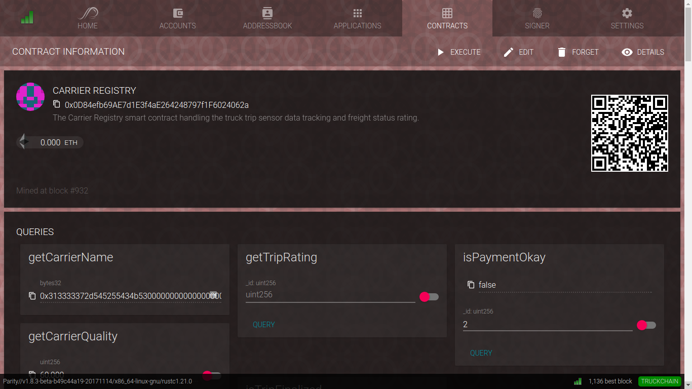

# refactored-train

Truck Chain blockchain specification and smart contract logic

## blockchain configuration

how to connect to the chain? instructions can be found in `chains/`[README.md](chains/README.md)

## smart contract logic

can be found in `contracts/*.sol`

application binary interface `*.abi` and metadata `*.met` is available.

the **carrier registry** is deployed at address `0x0D84efb69AE7d1E3f4aE264248797f1F6024062a`

